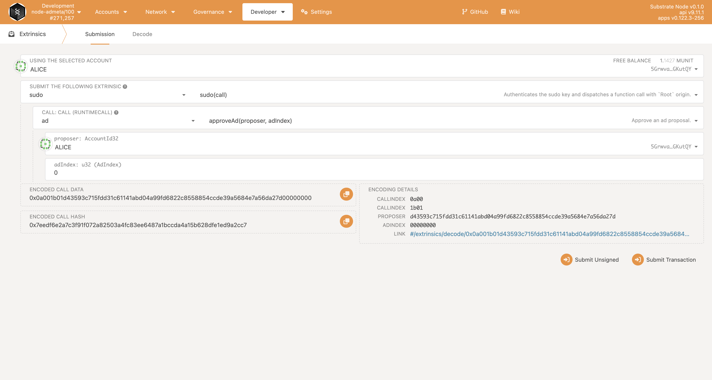
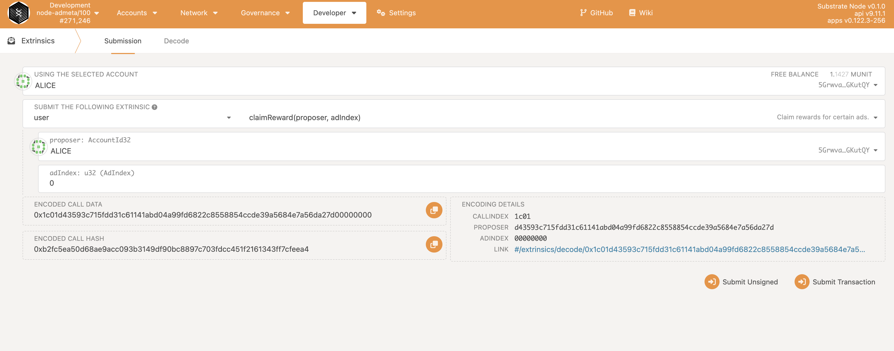

[](https://github.com/AdMetaNetwork/admeta-webapp/actions/workflows/nodejs-actions.yml)


## Introduce
AdMeta WebApp is built for users to better interact with AdMeta Blockchains. Now it supports AdMeta Testnet by default. Below are a few steps to introduce the basic functionalities.

## Getting Started

#### Testnet
Go to https://app.testnet.admeta.network/ to launch the WebApp.
#### Local Deployment
1. Generater Fleek a key and a secret (you can see the document [Fleek Doc](https://docs.fleek.co/storage/fleek-storage-js/)), and replace the corresponding key in the [c.example.ts](./config/c.example.ts) file, don’t have to change the file name, [upload.ts](./pages/api/upload.ts) is the upload img api file.

2. AdMeta default node is `wss://testnet.admeta.network`, If deployed locally, replace [constant.ts](./config/constant.ts) polkadot_network value, for example (`ws://localhost:9944`).

3. Run start
```bash
npm run dev
# or
yarn dev
```
Open http://localhost:3000 with your browser to see the result.


## Publish Ad
#### Connect Wallet
Click the button "Connect to Polkadot.js" on the top right to authorize this web app with your Polkadot.js wallet extension and select the account you want to sign in to AdMeta.

#### Create Ad Proposals
1. Switch to the tab "Ad Management" on the left sidebar, and you will see the ad proposals created by you if you have already done any. If not you can simply click "Publish new ad" to create one.

2. Follow the steps of ad proposal creation. First, you need to upload an image of your ad design. This image will be uploaded to IPFS. Also, you need to specify the related parameters of your proposal, for an explanation of these parameters please refer to https://admetanetwork.github.io/admeta/pallet_ad/pallet/enum.Call.html#variant.propose_ad. After this, you can preview this ad, and submit it if everything is correct.

3. A sign request is prompted at this time to send an ad proposal transaction, and after signing and sending this transaction, you will see the ad proposal appear on your ad lists with the status "Pending". This means it is not approved yet.  You have done it successfully now! 

## Ad Approval
Ad Approval can be only done by AdMeta council, with a manual review of ad contents. 

If you are building the project locally then use Polkadot.js app and use ALICE with sudo command call ad > approveAd interface.


## Claim Rewards
#### Create User Profile
Creating AdMeta user profile allows you to match ads that suit your preferences and earn rewards. Switch to the tab "Profile" to create your own user profile.

#### Claim
At present, the testnet is that the completion of the advertising task is verified by the centralized interface. 

If you are building the project locally then use Polkadot.js app to call the user > claimReward interface.



## Detailed Guide

For detailed guide documents, please view here,
[Admeta Webapp Guide](https://docs.admeta.network/guides/how-to-use-admeta-webapp).
## License

GPLv3

