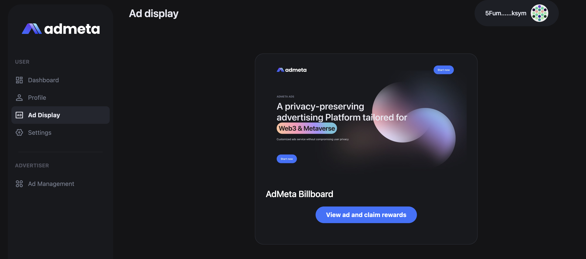

[](https://github.com/AdMetaNetwork/admeta-webapp/actions/workflows/nodejs-actions.yml)


## Introduce
AdMeta WebApp is built for users to better interact with AdMeta Blockchains. Now it supports AdMeta Testnet by default. Below are a few steps to introduce the basic functionalities.

## Getting Started

#### Testnet
Go to https://app.testnet.admeta.network/ to launch the WebApp.
#### Local Deployment
1. Generater Fleek a key and a secret (you can see the document [Fleek Doc](https://docs.fleek.co/storage/fleek-storage-js/)), and replace the corresponding key in the [c.example.ts](./config/c.example.ts) file, don’t have to change the file name, [upload.ts](./pages/api/upload.ts) is the upload img api file.

2. AdMeta default node is `wss://testnet.admeta.network`, If deployed locally, replace [constant.ts](./config/constant.ts) polkadot_network value, for example (`ws://localhost:9944`).

3. Run start
```bash
npm run dev
# or
yarn dev
```
Open http://localhost:3000 with your browser to see the result.


## Ad Approval

Ad Approval can be only done by AdMeta council, with a manual review of ad contents. You can ask for the approval of your ad in our Telegram and we will help you to approve your ads. After approval, the "Pending" status will become "Approved", and your ad will be published for everyone on AdMeta Network!

## Check Matched Ads and Claim Rewards
Ad matching happens during the idle and less busy time of AdMeta Blockchain, and it's done automatically without any inputs from either users or advertisers. Switch to the tab "Ad Display" to check if you have any matched ads now. 
If you have matched ads, you will see it like this:


Click the button under the ad display, and you will be navigated to an advertiser-customized page, to complete a series of challenges.


The challenges can be defined and built by advertisers with AdMeta SDK. Possible challenges are wallet connecting of new products, product intro video watching, joining the project telegram group, buying an NFT of certain collections on OpenSea, etc.
After completing all required tasks, you are eligible to claim your reward. Click "Claim rewards" and you will be navigated back to your AdMeta WebApp page. And now your rewards have been claimed to your own wallet.

## Detailed Guide

For detailed guide documents, please view here,
[Admeta Webapp Guide](https://docs.admeta.network/guides/how-to-use-admeta-webapp).
## License

GPLv3

